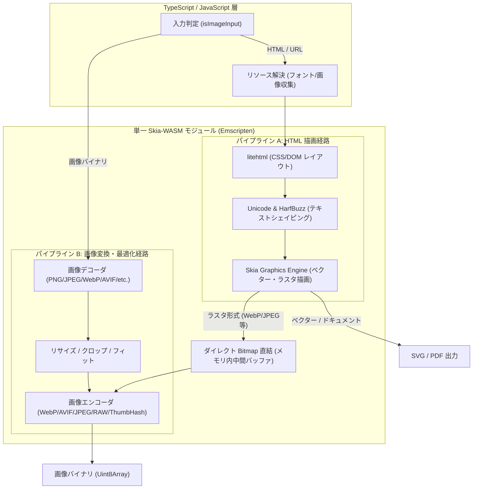

# アーキテクチャと内部設計

**wasm-html-to-image** は、HTML レイアウト・ベクター描画エンジンと画像最適化・圧縮エンジンを 1 つのネイティブバイナリ（WebAssembly）に統合した設計になっています。

従来のシステムでは、「HTML を描画して PNG を出力するエンジン」と「PNG を受け取って WebP/AVIF に圧縮するエンジン」が分離しており、巨大なバッファをプロセス間や JS ヒープ間で往復させる必要がありました。wasm-html-to-image はこれを単一の Skia-WASM モジュール内で完結させます。

---

## 1. 2つの処理経路（パイプライン）

入力データの種類（HTML か 画像か）に応じて、自動的かつ効率的に最適なパイプラインが選択されます。

### パイプライン A: HTML 描画経路

1. **リソース収集 (`satoru_collect_resources`)**:
   HTML 内の `` タグの `src`、CSS 内の `background-image`、`@font-face` などを解析し、必要な画像やフォントの URL 一覧を抽出します。
2. **リソース投入 (`satoru_add_resource`)**:
   抽出されたリソースを TypeScript 側で並行フェッチ（プロセス内メモリキャッシュを活用）し、WASM インスタンスに渡します。
3. **レイアウトと描画**:
   `litehtml` によるボックスレイアウト計算、HarfBuzz / SkUnicode によるテキストシェイピングを経て、Skia サーフェス上に描画します。
4. **出力段**:
   - `svg` / `pdf`: Skia のベクター出力機能により、そのまま文字列またはバイナリを返却。
    - ラスタ形式 (`png`, `jpeg`, `webp`, `avif`, `jxl` 等): 描画された Bitmap を JS ヒープにコピーすることなく、内部メモリ上で直接画像エンコーダ段に直結して目的のフォーマットにエンコードします。

### パイプライン B: 画像変換・最適化経路

入力がバイナリ（PNG, JPEG, WebP, GIF, AVIF, BMP のマジックバイト）または `data:image/*` 文字列の場合、HTML 描画段は完全にスキップされます。

1. **直接デコード**: 画像最適化エンジンが直接バイト列を展開。
2. **変換・リサイズ**: `width`, `height`, `fit`, `crop` などの指定に従いリサイズ・切り抜きを実行。
3. **エンコード**: 指定されたフォーマット（JPEG, WebP, AVIF, RAW, ThumbHash 等）へ高速エンコード。
4. **特殊出力**:
   - 画像 → `svg`: PNG data URL の `<image>` タグでラップした SVG を即座に生成。
   - 画像 → `pdf`: 1 ページ等倍で `drawImage` 配置された PDF を生成。

---

## 2. ディレクトリとソースコード構成

リポジトリ内のコードは以下のように分離・協調しています：

- `src/cpp/api`: Emscripten エクスポート関数 (`main.cpp`, `satoru_api.cpp`, `converter_api.cpp`)
- `src/cpp/core`: レイアウトエンジン、Unicode サービス、テキストレイアウト、LRU キャッシュ
- `src/cpp/renderers`: Skia ベースのレンダラー実装 (PNG, SVG, PDF, WebP)
- `src/cpp/bridge`: C++ と TypeScript の間で共有するメモリ構造とタグ定義
- `packages/html-to-image/src`:
  - `core.ts`: 全経路の統合制御、リソースフェッチ、フォーマット判定
  - `loader.ts`: WASM バイナリのロード、初期化、プロセス内シングルトン管理
  - `single.ts`: 単一 WASM を内包したゼロコンフィグエントリーポイント
  - `workerd.ts`: Cloudflare Workers (workerd) 専用バインディング
  - `workers.ts`: マルチスレッド Worker プール実装
  - `cli.ts`: コマンドライン実行インターフェース

---

## 3. リソース解決とグローバルキャッシュ

高スループットな画像生成では、外部リソース（フォントや画像）のフェッチが最大のボトルネックとなります。wasm-html-to-image は以下の最適化を備えています：

1. **Google Fonts 自動解決**:
   CSS 内で汎用フォント（`sans-serif`, `serif`, `monospace` 等）や任意の Web フォントが指定された場合、最適な WOFF2/TTF フォントを自動取得します。
2. **プロセス内インメモリキャッシュ**:
   一度フェッチされたフォントや画像データは URL をキーとしてメモリにキャッシュされ、2 回目以降のレンダリングではネットワークアクセスなしで即座に適用されます。
3. **カスタムフォント注入 (`fallbackFonts`)**:
   ローカルのフォントファイルバッファや Data URL を直接オプションで渡すことで、外部ネットワーク接続が禁止されている環境でも任意のフォントでレンダリングが可能です。
