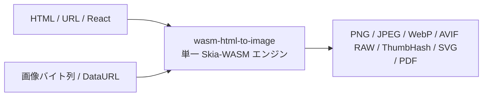

# wasm-html-to-image の概要

**wasm-html-to-image** は、HTML 描画エンジン（Satoru）と画像変換・最適化エンジン（wasm-image-optimization）を 1 つの WebAssembly (Emscripten) モジュールに統合した、超高速・自己完結型の画像生成・変換ライブラリです。

Chromium や Puppeteer、Playwright などの重厚なヘッドレスブラウザを一切必要とせず、サーバーサイド、Cloudflare Workers 等のエッジ環境、ブラウザ、CLI など多様な環境でポータブルに動作します。



## 主な特徴

- **単一 WASM モジュール統合**: HTML のパース・CSS レイアウト・Skia 描画・画像エンコード（WebP/AVIF/JPEG等）を単一バイナリ内で実行。中間データを JS とやり取りするオーバーヘッドをゼロに。
- **多彩な入力**: HTML 文字列、HTML 文字列配列（複数ページ PDF 用）、URL（Web ページ直接描画）、各種画像バッファ（PNG, JPEG, WebP, GIF, AVIF, BMP, Data URL）に対応。
- **多彩な出力フォーマット**: SVG（ベクター）、PNG、JPEG、WebP、AVIF、RAW ピクセル、ThumbHash、複数ページ対応 PDF を標準サポート。
- **Zero-Config `render()`**: `wasm-html-to-image/single` により、事前の WASM ロード設定や初期化不要で即座に実行可能。
- **Edge・Cloudflare Workers 最適化**: `wasm-html-to-image/workerd` および `edge-light` サブパスにより、エッジ環境の制限に完全適合。
- **並列 Worker プール**: `wasm-html-to-image/workers` によるマルチスレッド処理で、大量のリクエストやバッチ処理を高速並行実行。
- **リッチなエコシステム**: React / Preact JSX コンポーネント描画や、UnoCSS ベースの Tailwind ユーティリティクラスによるインラインスタイリングを標準サポート。

---

## クイックスタート

### インストール

```bash npm2yarn
npm install wasm-html-to-image
```

### 1. 最もシンプルな使い方 (`/single`)

ゼロコンフィグ版の `wasm-html-to-image/single` をインポートすると、WASM モジュールが自動解決され、すぐに `render()` を呼び出すことができます。

```typescript
import { render } from "wasm-html-to-image/single";

// HTML から PNG を生成
const png = await render({
  value: `<div style="background: linear-gradient(135deg, #667eea, #764ba2); padding: 40px; color: white; border-radius: 16px; font-family: sans-serif;">
    <h1 style="margin: 0; font-size: 32px;">Hello wasm-html-to-image</h1>
    <p style="margin-top: 8px; opacity: 0.9;">High-performance serverless rendering</p>
  </div>`,
  width: 800,
  format: "png",
});

// 画像から WebP への変換・圧縮も同じ render() 関数で実行可能
const webp = await render({
  value: png,
  format: "webp",
  quality: 80,
});
```

### 2. インスタンスの明示的構築 (`/index`)

サーバー起動時などに WASM モジュールを一度だけ初期化し、再利用することで最大のスループットを発揮します。

```typescript
import { loadHtmlToImageModule, htmlToImage } from "wasm-html-to-image";

// モジュールのロード（プロセス内でキャッシュ可能）
const mod = await loadHtmlToImageModule();

// HTML から WebP を出力
const result = await htmlToImage(mod, {
  value: "<h1>Fast Rendering</h1>",
  width: 1200,
  height: 630,
  format: "webp",
  quality: 85,
});
```

---

## サブパス一覧

用途やランタイム環境に応じて、最適なサブパスを選択できます。

| サブパス                        | 対象環境 / 用途            | 説明                                                     |
| ------------------------------- | -------------------------- | -------------------------------------------------------- |
| `wasm-html-to-image`            | 全環境（明示的制御）       | コア関数 `loadHtmlToImageModule`, `htmlToImage` を提供   |
| `wasm-html-to-image/single`     | Node.js / バンドラ         | 単一WASM内包、ゼロコンフィグで即利用可能な `render()`    |
| `wasm-html-to-image/workerd`    | Cloudflare Workers         | WebAssembly.Module インポートに対応した Workers 最適化版 |
| `wasm-html-to-image/edge-light` | Vercel Edge / Edge Runtime | Edge Runtime 向け最適化版                                |
| `wasm-html-to-image/workers`    | Node.js / ブラウザ         | Worker スレッド / Web Worker による並列処理プール        |
| `wasm-html-to-image/react`      | React 連携                 | React JSX ノードを直接描画するラッパー                   |
| `wasm-html-to-image/preact`     | Preact 連携                | Preact JSX ノードを直接描画するラッパー                  |
| `wasm-html-to-image/tailwind`   | スタイリング               | Tailwind CSS クラスをインラインスタイルへ展開            |

---

## プロジェクト構成

- **`packages/html-to-image`**: 公開 npm パッケージ。TypeScript ファサード、各ランタイム対応、CLI、Worker プール。
- **`packages/cloudflare-ogp`**: Cloudflare Workers で OGP 画像生成を行うサンプルプロジェクト。
- **`packages/deno-ogp`**: Deno Deploy での利用サンプル。
- **`packages/playground`**: ブラウザ上で動作する Web Playground。
- **`packages/visual-test`**: 視覚回帰テストスイート。
- **`src/cpp`**: C++ / Skia / litehtml コアエンジンおよび Emscripten バインディング。
