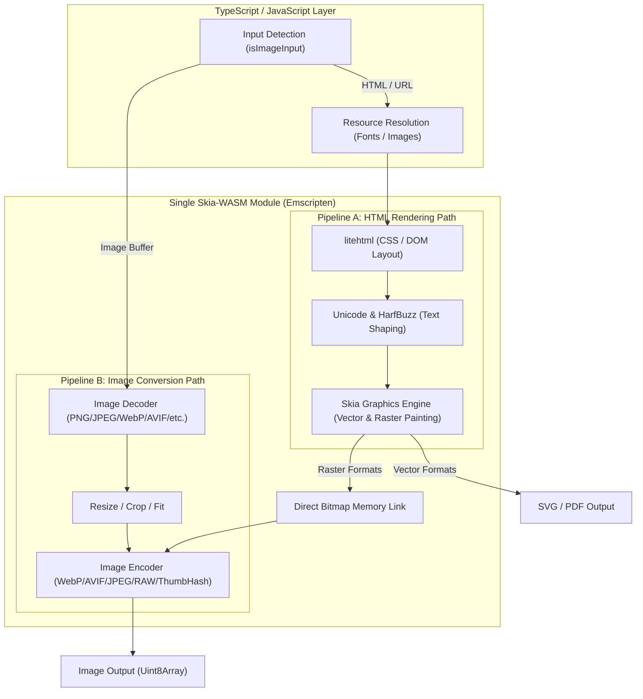

# Architecture & Internal Design

**wasm-html-to-image** merges an HTML layout/rendering pipeline and an image optimization/encoding pipeline into a single native WebAssembly binary.

Traditional setups require two separate libraries: one rendering HTML to PNG, and another re-encoding PNG to WebP or AVIF. This causes substantial memory allocations and data copying across JavaScript boundaries. wasm-html-to-image eliminates this overhead by piping the rendered Bitmap directly to the encoder within the single Skia-WASM module.

---

## 1. Dual Processing Pipelines

### Pipeline A: HTML Rendering Path

1. **Resource Discovery (`satoru_collect_resources`)**: Parses image URLs, `@font-face` rules, and CSS backgrounds from HTML/CSS.
2. **Resource Injection (`satoru_add_resource`)**: TypeScript fetches needed resources concurrently using in-memory process caches.
3. **Layout & Painting**: `litehtml` computes the box layout, HarfBuzz/SkUnicode shapes text, and Skia renders to an off-screen surface.
4. **Output Generation**:
   - `svg` / `pdf`: Skia streams vector commands directly.
   - Raster formats: Rendered Bitmap is piped straight to native encoders without leaving WASM linear memory.

### Pipeline B: Image Conversion & Optimization Path

When given image buffers or data URLs:

1. **Direct Decoding**: Bypasses the HTML layout engine completely.
2. **Transformations**: Applies `width`, `height`, `fit`, and `crop` directly in the image pipeline.
3. **Encoding**: Compresses to WebP, AVIF, JPEG, RAW pixels, or ThumbHash.
