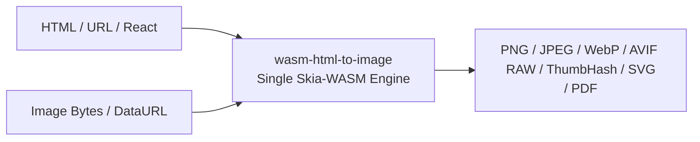

# Overview of wasm-html-to-image

**wasm-html-to-image** is an ultra-fast, self-contained HTML-to-image and image conversion engine that consolidates an HTML rendering engine (Satoru) and an image optimization engine (wasm-image-optimization) into a single WebAssembly (Emscripten) module.

It requires no heavy headless browsers like Chromium, Puppeteer, or Playwright, and runs portably across server-side runtimes, edge environments such as Cloudflare Workers, browsers, and the CLI.



## Key Features

- **Single Unified WASM Module**: Parses HTML, calculates CSS layout, renders with Skia, and encodes images (WebP/AVIF/JPEG, etc.) inside one binary without passing intermediate frame buffers across JS boundaries.
- **Versatile Inputs**: Supports HTML strings, HTML string arrays (for multi-page PDF), URLs, and raw image buffers (PNG, JPEG, WebP, GIF, AVIF, BMP, Data URLs).
- **Multiple Output Formats**: Direct SVG vector output, high-quality PNG, JPEG, WebP, AVIF, raw pixels, ThumbHash, and multi-page PDF generation.
- **Zero-Config `render()`**: Import `wasm-html-to-image/single` and render immediately without separate WASM asset distribution or setup.
- **Edge & Cloudflare Workers Ready**: Dedicated `wasm-html-to-image/workerd` and `edge-light` subpath exports fit constrained serverless edge environments.
- **Parallel Worker Pool**: Built-in multi-threaded pool in `wasm-html-to-image/workers` allows batch generation without stalling the main event loop.
- **Rich Ecosystem Integration**: Seamless JSX rendering for React and Preact, plus UnoCSS-based Tailwind CSS utility classes.

---

## Quick Start

### Installation

```bash npm2yarn
npm install wasm-html-to-image
```

### 1. Simplest Usage (`/single`)

```typescript
import { render } from "wasm-html-to-image/single";

// Generate PNG from HTML
const png = await render({
  value: `<div style="background: linear-gradient(135deg, #667eea, #764ba2); padding: 40px; color: white; border-radius: 16px; font-family: sans-serif;">
    <h1 style="margin: 0; font-size: 32px;">Hello wasm-html-to-image</h1>
    <p style="margin-top: 8px; opacity: 0.9;">High-performance serverless rendering</p>
  </div>`,
  width: 800,
  format: "png",
});

// 2. Convert and resize image with the same render() function
const webp = await render({
  value: png, // Pass raw image buffer (Uint8Array / Buffer) directly
  width: 400, // Target resized width
  format: "webp",
  quality: 80,
});
```

---

## 🖼️ Image-to-Image Conversion & Optimization

In addition to HTML rendering, **wasm-html-to-image** functions as a high-speed, native **image conversion, resizing, and optimization engine**.

```mermaid
graph LR
    InputImg[Input Image <br/> PNG / JPEG / WebP / GIF / AVIF / BMP] --> AutoDetect{Magic-byte Auto Detection}
    AutoDetect --> FastPath[Fast Image Pipeline <br/> (Bypasses HTML layout)]
    FastPath --> OutputImg[Output Image <br/> WebP / AVIF / JPEG / PNG / ThumbHash / SVG / PDF]
```

### Highlights

- **Automatic Input Detection (`isImageInput`)**: Detects magic bytes for PNG, JPEG, WebP, GIF, AVIF, and BMP or `data:image/...` strings automatically.
- **Zero Overhead**: Bypasses the HTML/CSS DOM layout phase completely, routing directly from Skia's native decoders into the image encoding pipeline.
- **Comprehensive Output Features**:
  - **Modern Next-Gen Compression**: Convert large PNGs/JPEGs into compact WebP or AVIF files.
  - **Resize & Fit**: Supports `width`, `height`, `fit` (`contain` / `cover` / `fill`), and `crop`.
  - **Vector SVG Generation**: Wraps image data directly inside an SVG document.
  - **Single-page PDF Generation**: Wraps image into a 1-page vector PDF.
  - **ThumbHash Generation**: Generates ultra-compact placeholder blur hashes directly.

### Code Example: Image-to-Image Conversion

```typescript
import fs from "node:fs/promises";
import { render } from "wasm-html-to-image/single";

// Read JPEG image buffer
const jpegBuffer = await fs.readFile("photo.jpg");

// 1. Convert JPEG -> AVIF with resizing and compression
const avif = await render({
  value: jpegBuffer,
  width: 800,
  format: "avif",
  quality: 75,
  speed: 6,
});

// 2. Generate ThumbHash placeholder bytes from JPEG
const thumbhash = await render({
  value: jpegBuffer,
  width: 100,
  format: "thumbhash",
});

// 3. Convert JPEG -> Single-Page PDF
const pdf = await render({
  value: jpegBuffer,
  format: "pdf",
});
```

### 2. Explicit Instance Management (`/index`)

```typescript
import { loadHtmlToImageModule, htmlToImage } from "wasm-html-to-image";

// Load module once at application startup
const mod = await loadHtmlToImageModule();

// Render HTML to WebP
const result = await htmlToImage(mod, {
  value: "<h1>Fast Rendering</h1>",
  width: 1200,
  height: 630,
  format: "webp",
  quality: 85,
});
```

---

## Subpath Overview

| Subpath                         | Target Environment / Purpose | Description                                            |
| ------------------------------- | ---------------------------- | ------------------------------------------------------ |
| `wasm-html-to-image`            | Universal (explicit control) | Exports core `loadHtmlToImageModule` and `htmlToImage` |
| `wasm-html-to-image/single`     | Node.js / Bundlers           | Bundles single WASM; zero-config `render()`            |
| `wasm-html-to-image/workerd`    | Cloudflare Workers           | Optimized for WebAssembly.Module imports in Workers    |
| `wasm-html-to-image/edge-light` | Vercel Edge / Edge Runtime   | Optimized for Vercel Edge environments                 |
| `wasm-html-to-image/workers`    | Node.js / Browsers           | Multi-threaded worker pool for high throughput         |
| `wasm-html-to-image/react`      | React integration            | Direct rendering wrapper for React JSX nodes           |
| `wasm-html-to-image/preact`     | Preact integration           | Direct rendering wrapper for Preact JSX nodes          |
| `wasm-html-to-image/tailwind`   | Styling pipeline             | Inlines Tailwind CSS utility classes                   |
